## Mở đầu

Trường Đại Học F** (giấu tên) gần đây đã sử dụng phương pháp thi cuồi kỳ bằng USB cho toàn bộ cơ sở, tôi nghe đồn là họ làm thế để chống gian lận.

Từng sinh viên sẽ được giám thị phát cho một chiếc USB chứa **Hệ điều hành** và **Phần mềm thi**, sinh viên sẽ gắn USB vào Laptop của họ và **Boot từ USB** thay vì sử dụng Hệ điều hành có sẵn trên máy.

Chắc đây là Trường Đại Học đầu tiên mà làm phương pháp thi bằng cách này, đúng là trường công nghệ có khác :\)

Đương nhiên, tôi cũng tò mò về cơ chế hoạt động của nó chứ, cả một hệ điều hành chứa trên USB mà, khá là thú vị.

## "Mượn" tệp tin trên USB

Sau khi gắn USB vào máy, tôi thấy USB đã **được mã hóa bằng Bitlocker** để tránh sinh viên đọc/chỉnh sửa nội dung trên USB.

Nhưng khi **Boot từ USB** tôi lại không thấy bước nhập mật khẩu giải mã, vậy thì chắc chắn mật khẩu giải mã cũng được để trên phân vùng nào đó của USB.

Mà trước hết tôi phải lén sao chép toàn bộ 64GB của USB về máy đã, tôi không điên tới nỗi mà "mượn" USB của trường rồi mang về nhà đâu

(Nghe nói bọn làm tool có cử người trộm luôn USB của trường, kinh thật).

Tôi sẽ không chỉ bạn dùng chính xác công cụ gì ở Windows để sao chép toàn bộ USB đâu (tôi chưa muốn bị đuổi học), nhưng nếu bạn dùng Linux và có USB trên tay thì:

```bash
$ sudo dd if=/dev/đường_dẫn_đến_usb of=/đường_dẫn_đến_windows.img bs=4M status=progress conv=sync,noerror
```

Được rồi, giờ ta đã có toàn bộ nội dung của USB 64GB, ta có thể nghiên cứu một cách an toàn rồi.

## Phân tích các phân vùng của USB

Đây là USB [Windows To Go](https://en.wikipedia.org/wiki/Windows_To_Go), được mã hóa bằng [Bitlocker](https://en.wikipedia.org/wiki/BitLocker).

Ở môi trường Linux, ta sử dụng `fdisk` để xem các phân vùng của Image được tạo ra từ việc nhân bản USB:

```
$ fdisk -l ./windows.img
Disk ./windows.img: 57.28 GiB, 61504880640 bytes, 120126720 sectors
Units: sectors of 1 * 512 = 512 bytes
Sector size (logical/physical): 512 bytes / 512 bytes
I/O size (minimum/optimal): 512 bytes / 512 bytes
Disklabel type: gpt
Disk identifier: [ĐÃ CHE]

Device      Start       End   Sectors  Size Type
windows.img1    2048    206847    204800  100M EFI System
windows.img2  206848    239615     32768   16M Microsoft reserved
windows.img3  239616 120126686 119887071 57.2G Microsoft basic data
```

Ta có 3 phân vùng: `EFI` (chứa dữ liệu Boot), `Recovery`, và `Tệp tin Hệ điều hành`

Riêng `Tệp tin Hệ điều hành` bị mã hóa bằng Bitlocker, thế thì chắc chắn Key giải mã sẽ ở `EFI`, ta kiểm tra xem:

```
$ ls /mnt/efi
total 3
-r-xr-xr-x 1 root root  156 Mar 20 06:14  [ĐÃ CHE].BEK
drwxr-xr-x 4 root root 1024 Feb  4 23:05  EFI
drwxr-xr-x 2 root root 1024 Feb  4 23:52 'System Volume Information'
```

Tuyệt vời! tệp `.BEK` đó chính là chìa khóa giải mã cho `Tệp tin Hệ điều hành`, giờ ta lấy nó để giải mã `Tệp tin Hệ điều hành`, kết quả:

```
$ ls -l windows/
total 3276808
drwxrwxrwx 1 root root       4096 Feb  4 17:03 '$Recycle.Bin'
drwxrwxrwx 1 root root       4096 Mar 31 09:12  CapturedImages
lrwxrwxrwx 1 root root         44 Feb  4 01:20 'Documents and Settings' -> /c/Users
-rwxrwxrwx 1 root root       8192 Mar 31 09:03  DumpStack.log.tmp
drwxrwxrwx 1 root root       4096 Mar  9 14:17 'Program Files'
drwxrwxrwx 1 root root       4096 Feb  4 17:08 'Program Files (x86)'
drwxrwxrwx 1 root root       4096 Feb  4 17:06  ProgramData
drwxrwxrwx 1 root root       4096 Feb  4 01:20  Recovery
drwxrwxrwx 1 root root       4096 Mar 19 23:20 'System Volume Information'
drwxrwxrwx 1 root root       4096 Feb  4 17:03  Users
drwxrwxrwx 1 root root       4096 Mar 30 07:34  Windows
-rwxrwxrwx 1 root root 3087007744 Mar 31 09:03  pagefile.sys
-rwxrwxrwx 1 root root  268435456 Mar 31 09:03  swapfile.sys
```

Ngon, chúng ta giờ đã có thể xem nội dung của USB.

## Phân tích HĐH trên USB

`C:\CapturedImages`: Khi ta bắt đầu thi thì phần mềm sẽ chụp ảnh thí sinh qua Webcam, `E**Client.exe` sẽ lưu 1 bản hình ảnh ở đó.

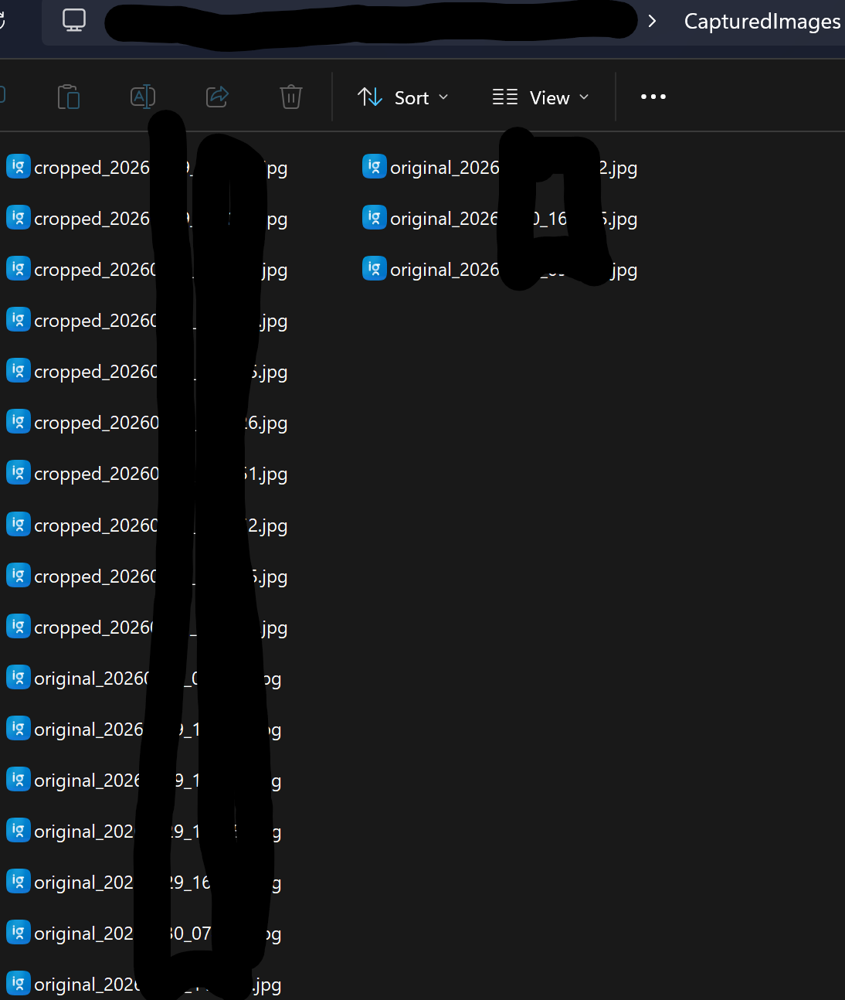

`C:\Windows\IoTEnterpriseS.xml` chứng tỏ rằng đây là `Windows 10 IoT Enterprise LTSC`, và có vài cài đặt đáng chú ý:

- `SystemResponsiveness` được đặt là `20` (ưu tiên task background/multimedia).

```xml
...
        <component name="Microsoft-Windows-BaseCrashDumpSettings" processorArchitecture="amd64" publicKeyToken="31bf3856ad364e35" language="neutral" versionScope="nonSxS">
			<AutoReboot>1</AutoReboot>
			<CrashDumpEnabled>7</CrashDumpEnabled>
			<DeviceDumpEnabled>1</DeviceDumpEnabled>
			<EnableLogFile>1</EnableLogFile>
		</component>
...
```

- Khi HĐH crash thì tự khởi động lại, và dump bộ nhớ được bật.

```xml
...
            <DefaultHighPerformancePpmLatencySensitivityPerfACSetting>99</DefaultHighPerformancePpmLatencySensitivityPerfACSetting>
			<DefaultHighPerformancePpmLatencySensitivityPerfDCSetting>99</DefaultHighPerformancePpmLatencySensitivityPerfDCSetting>
...
```

- Tweaks chỉnh hiệu năng tối đa.

```xml
...
        <component name="Microsoft-Windows-FileSystemDependencyMiniFilter" processorArchitecture="amd64" publicKeyToken="31bf3856ad364e35" language="neutral" versionScope="nonSxS">
			<ISOMountAllowNormalUser>1</ISOMountAllowNormalUser>
		</component>
...
```

- Người dùng được phép mount tệp `.iso`.

```xml
...
        <component name="Microsoft-Windows-explorer" processorArchitecture="amd64" publicKeyToken="31bf3856ad364e35" language="neutral" versionScope="nonSxS">
			<IndexSearchFilesDefaultValue>2</IndexSearchFilesDefaultValue>
			<NoSearchFilesDefaultValue>2</NoSearchFilesDefaultValue>
			<Start_SearchFiles>2</Start_SearchFiles>
			<UserSearchFilesDefaultValue>2</UserSearchFilesDefaultValue>
			<CDefaultValue>1</CDefaultValue>
			<GHideDefaultValue>0</GHideDefaultValue>
			<GMenuDefaultValue>0</GMenuDefaultValue>
			<GOpenDefaultValue>0</GOpenDefaultValue>
		</component>
...
```

- File indexing và search được tắt trong `File Explorer`.

`C:\Windows\Panther\unattend.xml` chứa vài thông tin liên quan đến danh tính của USB:

```xml
...
			<TimeZone>SE Asia Standard Time</TimeZone>
			<OOBE>
				<HideEULAPage>true</HideEULAPage>
				<HideOnlineAccountScreens>true</HideOnlineAccountScreens>
				<HideWirelessSetupInOOBE>true</HideWirelessSetupInOOBE>
				<NetworkLocation>Other</NetworkLocation>
				<ProtectYourPC>3</ProtectYourPC>
				<SkipMachineOOBE>true</SkipMachineOOBE>
				<SkipUserOOBE>true</SkipUserOOBE>
			</OOBE>
...
			<ComputerName>USB-E[ĐÃ CHE]-F[ĐÃ CHE]</ComputerName>
...
```

- Khá là Standard: Múi giờ SEA, không OOBE, tự động cập nhật, ... Thứ duy nhất đáng chú ý là mọi USB đều có tên: `USB-E**-F**` (đã che)

`C:\Windows\System32\DeviceCleanupCmd.exe`: Phần mềm xóa driver không được sử dụng.

`C:\Windows\INF\setupapi.setup.log` có đoạn:

```
...
>>>  [Sysprep Specialize - {3e17cbaa-ea8d-4347-b56c-5adeaaf64172}]
>>>  Section start 2026/02/04 16:17:02.530
     set: System Information:
     set:      BIOS Release Date: 12/01/2006
     set:      BIOS Vendor: innotek GmbH
     set:      BIOS Version: VirtualBox
     set:      System Family: Virtual Machine
     set:      System Manufacturer: innotek GmbH
     set:      System Product Name: VirtualBox
     set:      System Version: 1.2
     set: Initialized PnP data. Time = 141 ms. 16:17:02.715
     set: Removed non-present devices. Time = 0 ms. 16:17:02.715
     set: Updated driver package signatures. Time = 8750 ms. 16:17:11.477
     set: Installed devices. Time = 3047 ms. 16:17:14.523
     set: No device state migrated.
     set: Cleaned up unneeded PnP data. Time = 31 ms. 16:17:14.555
     set: Installed primitive drivers. Time = 16 ms. 16:17:14.570
<<<  Section end 2026/02/04 16:17:14.570
<<<  [Exit status: SUCCESS]
...
```

- Cho thấy USB được thử nghiệm trong máy ảo.

`C:\Program Files\SDIO\`: Chứa phần mềm `Snappy Driver Installer Origin`:

```
$ ls -l
total 10424
-rwxrwxrwx 1 root root 5121536 Mar  6  2025 SDI-drv.exe
-rwxrwxrwx 1 root root 5543424 Mar  3 20:39 SDI64-drv.exe
-rwxrwxrwx 1 root root     817 Jul 31  2016 SDI_auto.bat
drwxrwxrwx 1 root root    4096 Mar  9 14:18 drivers
drwxrwxrwx 1 root root    4096 Mar  9 14:18 index
drwxrwxrwx 1 root root    4096 Mar  9 14:18 scripts
-rwxrwxrwx 1 root root     420 Mar  4 22:16 sdi.cfg
drwxrwxrwx 1 root root    4096 Mar  9 14:18 tools
drwxrwxrwx 1 root root    4096 Mar  4 22:16 update
-rwxrwxrwx 1 root root     102 Dec 21  2012 www.DriverOff.net.url
-rwxrwxrwx 1 root root      94 Dec 21  2012 www.SamLab.ws.ur
```

- Kèm theo log ở `C:\Windows\Logs\SDILog\` (đã che):

```
$ ls -l
total 488
-rwxrwxrwx 1 root root  87643 Feb  4 18:36 2026_02_04__18_36_40__USB-E**-F**_log.txt
-rwxrwxrwx 1 root root   6847 Feb  4 18:36 2026_02_04__18_36_41__USB-E**-F**_state.snp
-rwxrwxrwx 1 root root  87643 Feb  4 18:36 2026_02_04__18_36_49__USB-E**-F**_log.txt
-rwxrwxrwx 1 root root   6842 Feb  4 18:36 2026_02_04__18_36_50__USB-E**-F**_state.snp
-rwxrwxrwx 1 root root    874 Mar  6 13:19 2026_03_06__13_19_11__USB-E**-F**_log.txt
-rwxrwxrwx 1 root root  86607 Mar  6 13:19 2026_03_06__13_19_15__USB-E**-F**_log.txt
-rwxrwxrwx 1 root root   6743 Mar  6 13:19 2026_03_06__13_19_18__USB-E**-F**_state.snp
-rwxrwxrwx 1 root root      0 Mar  7 22:05 2026_03_07__22_05_27__USB-E**-F**_log.txt
-rwxrwxrwx 1 root root 189972 Mar  9 12:22 2026_03_09__12_22_19__USB-E**-F**_log.txt
-rwxrwxrwx 1 root root   6698 Mar  9 12:22 2026_03_09__12_22_21__USB-E**-F**_state.snp
```

`C:\Program Files\Driver Installer\DriverInstaller.exe`: Như tên gọi, phần mềm cài driver.

Trong USB cũng có các Drivers đặc biệt:

```
* UWB Audio/Video Drivers:
C:\Windows\System32\Drivers\ALDWA.sys
C:\Windows\System32\Drivers\HWA.sys
C:\Windows\System32\Drivers\WQ_cba.sys
C:\Windows\System32\Drivers\WQ_dwa.sys
C:\Windows\System32\Drivers\WQ_hwa.sys
```

`C:\Program Files\LangKeyTester_win-x64\LangKeyTester.exe`: Phần mềm để Test bàn phím và ngôn ngữ IME.


## Phân tích phần mềm thi trên USB

Giờ ta đến đoạn gây cấn nhất của bài viết này, ở `C:\Users\kioskUser0\Downloads` có chứa phần mềm `E**Client.exe` (đã che), đó chính là phần mềm thi.

Phần mềm thi có phát hiện môi trường Windows To Go và nộp bài thi cho máy chủ nội bộ trong trường.

Cũng có tệp `C:\Users\kioskUser0\Downloads\re_submit.exe`: Để nộp lại bài thi?

Như ta có thể thấy trong tên User, môi trường Windows To Go này đang ở chế độ [Kiosk](https://learn.microsoft.com/en-us/windows/configuration/kiosk/), trong việc chống gian lận thì chế độ này hoàn hảo, vì thí sinh không thể mở thêm phần mềm nào khác.

## Boot & Phân tích trong VM

Nãy giờ nói Lý thuyết như thế là đủ rồi, ta dùng `qemu-img` để tạo ra `.vmdk` từ file `.img`, rồi đưa nó vào `VMWare`:

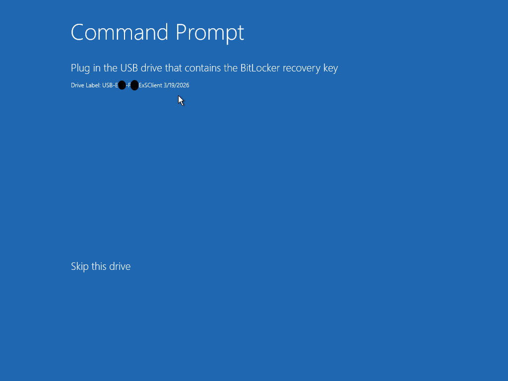

- Thì ra ổ `C:` có tên là `ExSClient`.

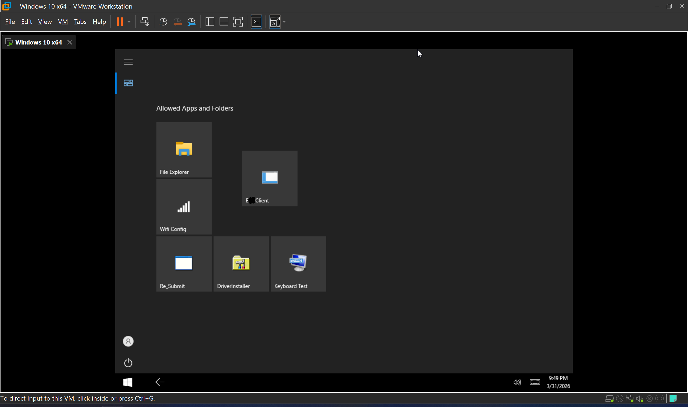

- Tuyệt vời, nó boot kìa.

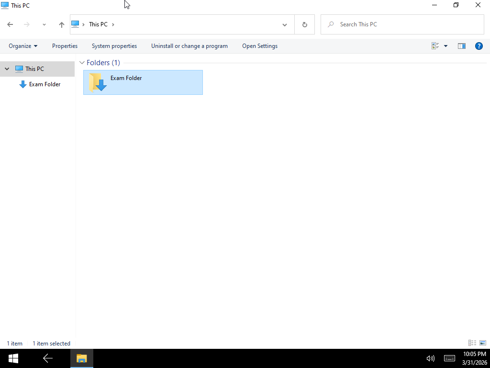

- Trong `File Explorer` thí sinh chỉ có quyền truy cấp vào thư mục `Downloads`, nơi mà chứa phần mềm thi (`E**Client.exe`).

- Cố nhấn vào nút khác thì chuyện này sẽ xẩy ra:

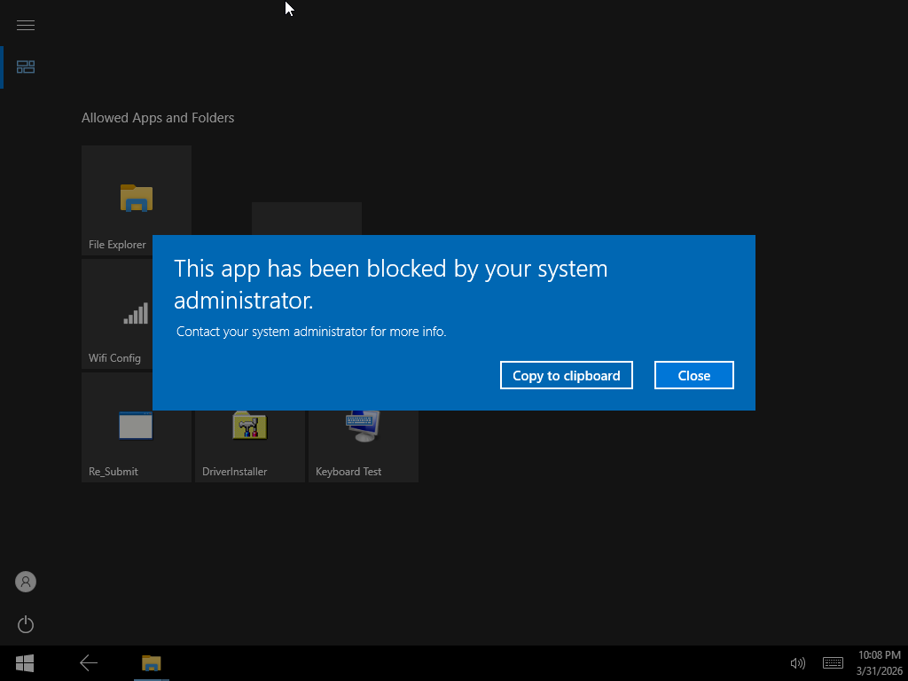

- Nút `Wifi Config` sẽ kích hoạt menu này:

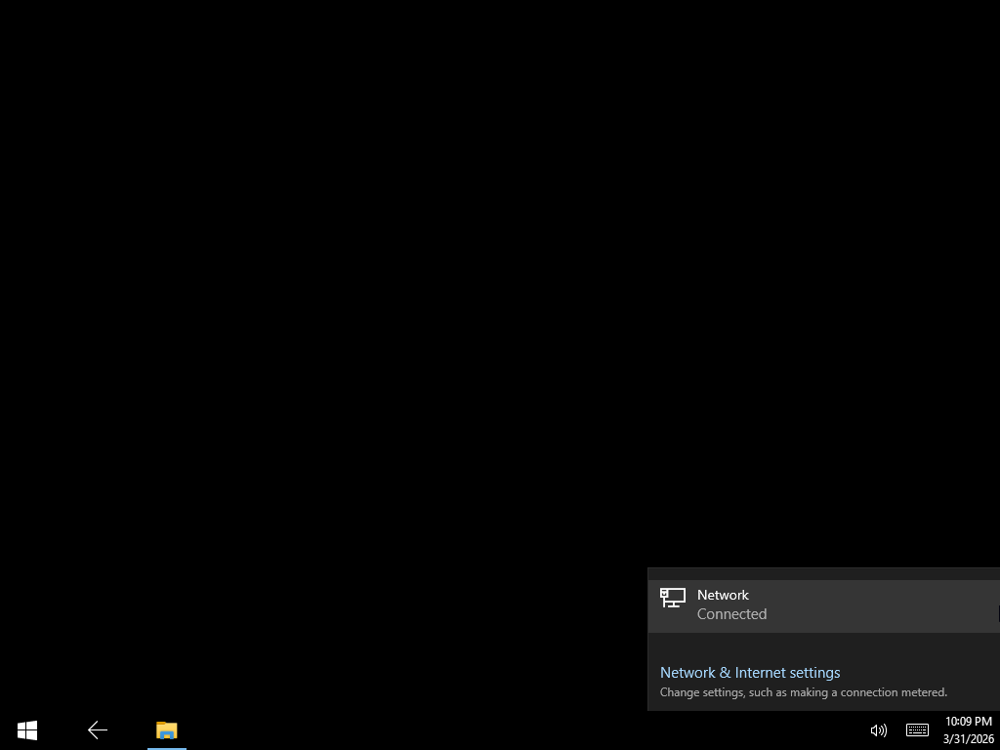

- Nút mở `Settings` đương nhiên bị block như trên.

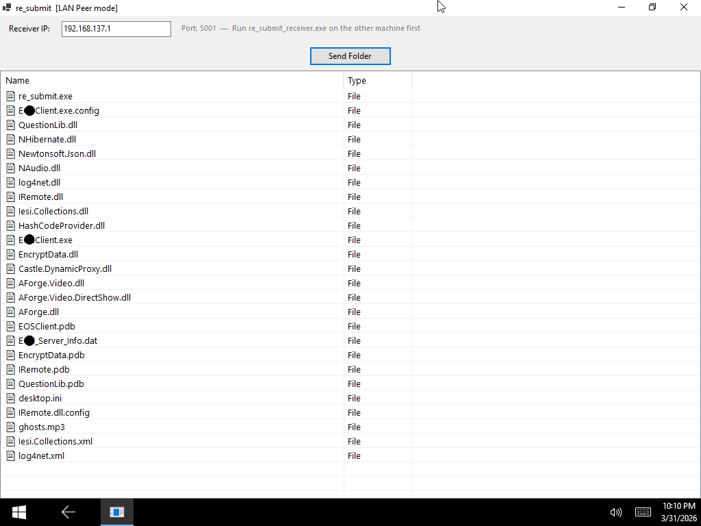

- Phần mềm `re_submit.exe` để nộp lại bài?

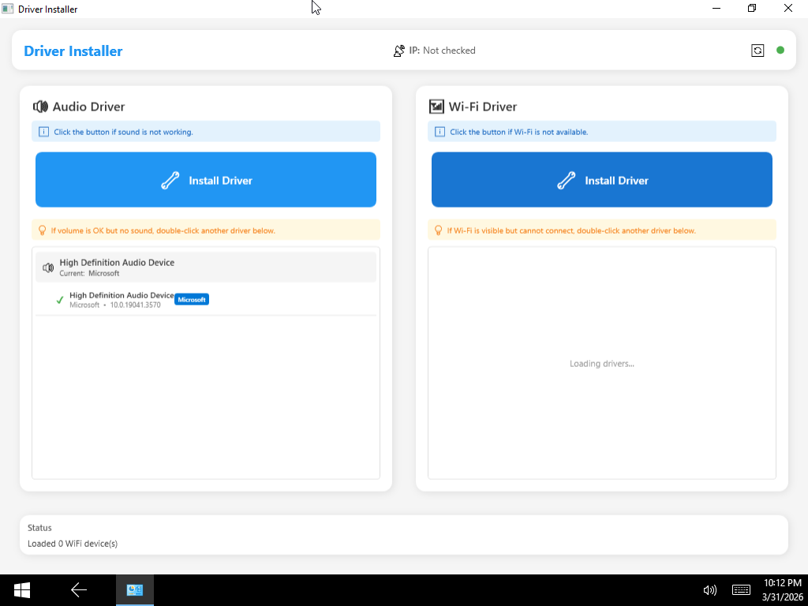

- Phần mềm `Driver Installer` để cài thêm drivers.

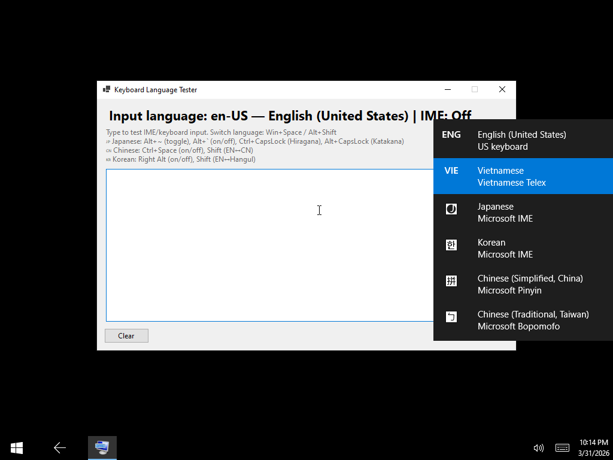

- Phần mềm `Keyboard Test` để thử bàn phím và IME.

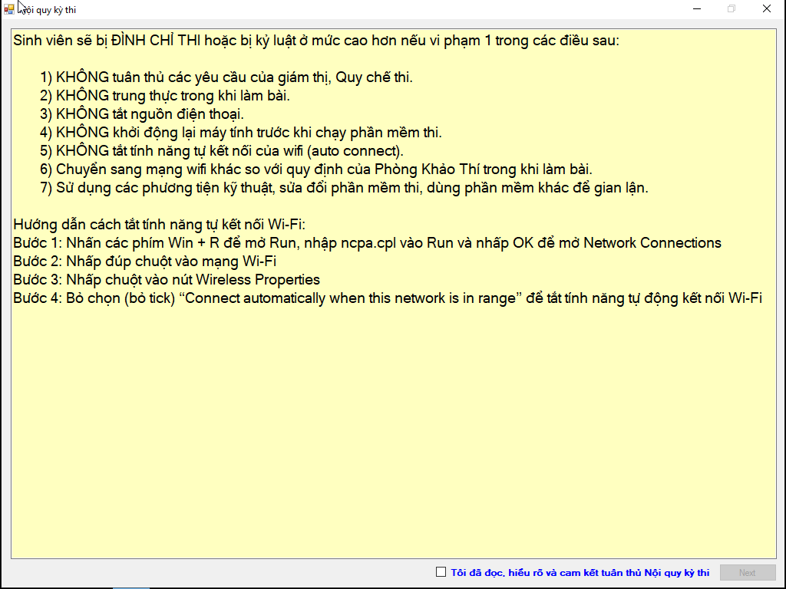

- Phần mềm thi `E**Client.exe`, phần mềm luôn được chạy ở chế độ Full Screen và `Alt + Tab` bị chặn trong lúc thi.

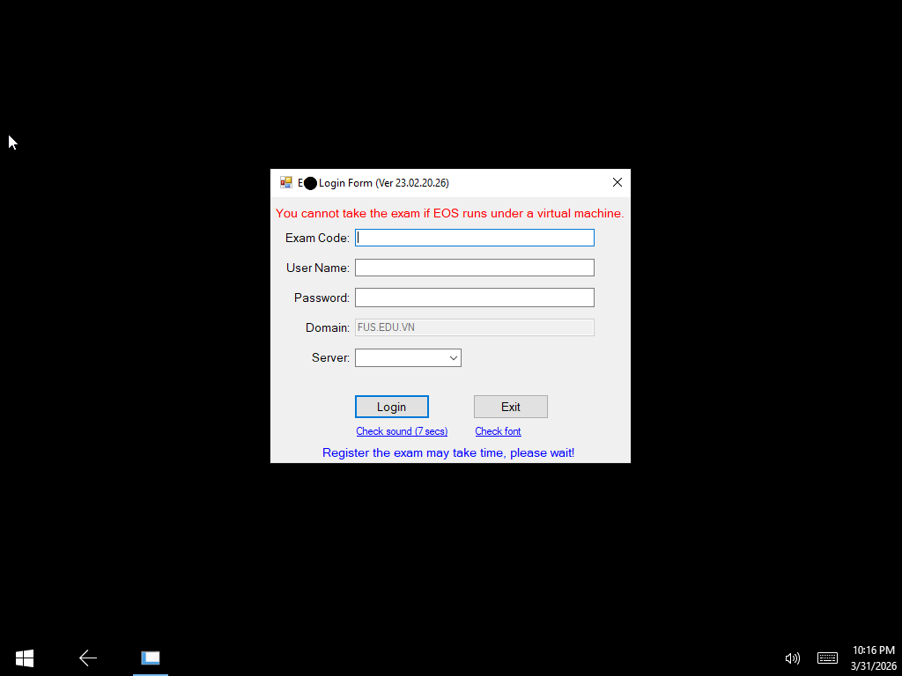

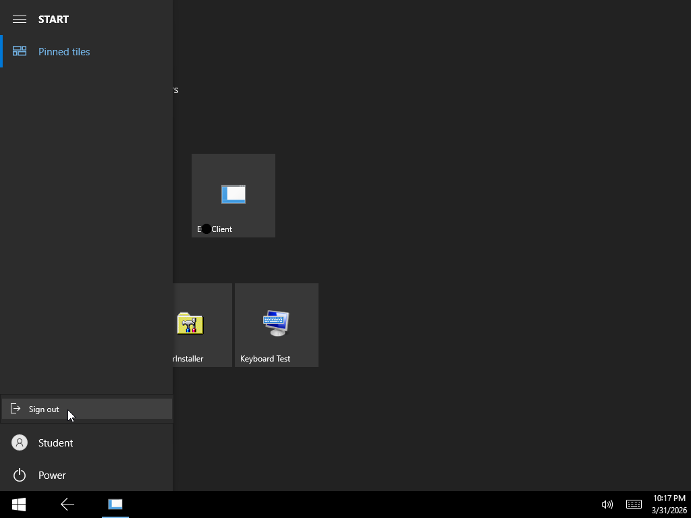

- Môi trường thi rất bảo mật, không thể truy cập phần mềm nào khác trong lúc thi, và mọi nút đều bị vô hiệu hóa.

## Kết luận

- Đây là một môi trường Hệ Điều Hành chứa trong USB khá bảo mật, việc gian lận rất khó hoặc không thực tế.

- Giả sử nếu ta bằng một cách nào đó can thiệp được vào USB để gỡ giới hạn `Alt + Tab` ra khỏi phần mềm thi, và gỡ hết toàn bộ các bẫy khác, thì ta vẫn phải tìm cách để lén mở thêm phần mềm trong môi trường Windows Kiosk mà không bị giám thị bắt, đó là điều rất khó và không thực tế.

- Nói chung, ngoài tính ổn định của môi trường Windows do drivers và phần cứng đa dạng thì về mặt lý thuyết môi trường này rất bảo mật. Tuy nhiên việc mua khoảng 300 cái USB 64GB thì cũng tốn kha khá tiền.